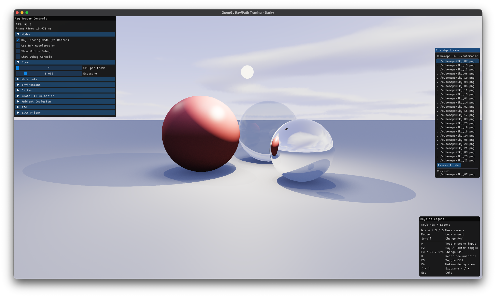

# OpenGL Ray / Path Tracing

A **modular, educational OpenGL-based real-time ray/path tracer** implementing hybrid **raster + ray tracing**, BVH-accelerated triangle scenes, environment lighting, TAA, SVGF-style reprojection filtering, and a fully interactive ImGui control panel.

Designed for **clarity, experimentation, and graphics education**, this project shows how far you can push a “classic” OpenGL 4.1 pipeline without compute shaders.


*Sample render output (analytic scene + BVH, ray mode)*

---

## 🚀 Overview

This project demonstrates how to implement **GPU ray tracing** on top of a traditional **OpenGL fragment shader pipeline**, using:

- Full-screen ray generation in a fragment shader
- BVH data stored in **texture buffers**
- MRT G-Buffer + motion vectors
- Temporal accumulation + reprojection + optional SVGF-style filtering

The renderer runs in two modes:

- **Ray mode** – full analytic + BVH-accelerated ray tracing
- **Raster mode** – classic forward rendering preview (for debugging / comparison)

Key focus areas:

- Building a **modern OpenGL 4.1** rendering loop
- Structuring **GPU resources** (FBOs, textures, TBOs) cleanly
- Implementing **temporal accumulation + motion vectors** without compute shaders
- Live tuning & debugging with an ImGui control panel

---

## ✨ Core Features

### 🌗 Hybrid Rendering

- Full-screen ray tracing via fragment shader
- Analytic primitives + BVH meshes
- Raster fallback pipeline with ground, bunny, sphere
- Live point-light marker preview in raster mode

### 🧩 BVH System

- CPU median-split BVH
- Packed node + triangle data in TBOs
- Model picker scanning `models/` for `.obj` files

### 💡 Lighting & Materials

- Sun, sky, point lights
- Glass, mirror, and albedo materials
- Fully tweakable via GUI

### 🌍 Environment Mapping

- Cubemap loader (4×3 cross images)
- Env map picker scanning `cubemaps/`
- Dummy fallback cubemap

---

## 🔁 Temporal Accumulation & Filters

- Ping-pong accumulation buffers
- View/projection reprojection
- Jitter (still vs moving scales)
- TAA thresholds & history weights
- SVGF-like variance filters

---

## 🧩 Directory Structure

```
OpenGL-RayTracing/
├── docs/
├── include/
├── src/
├── shaders/
├── models/
├── cubemaps/
├── libs/
├── CMakeLists.txt
└── README.md
```

---

## 🛠️ Build Instructions

### Requirements

- CMake ≥ 3.15
- OpenGL 4.1
- GLFW
- GLAD
- glm
- stb_image
- C++17

### macOS / Linux

```
brew install cmake glfw glm
```
```
git clone --recursive https://github.com/Darky-The-Dragon/OpenGL-RayTracing.git
```
```
cd OpenGL-RayTracing
```
If submodules didn't clone properly, run this:
```
git submodule update --init --recursive
```
```
mkdir build && cd build
```
```
cmake ..
```
```
cmake --build . --config Release -j 8
```
```
./OpenGLRayTracing
```

### Windows

```
git clone --recursive https://github.com/Darky-The-Dragon/OpenGL-RayTracing.git
```
```
cd OpenGL-RayTracing
```
If submodules didn't clone properly, run this:
```
git submodule update --init --recursive
```
```
mkdir build && cd build
```
```
cmake ..
```
```
cmake --build . --config Release -j 8
```
```
.\Release\OpenGLRayTracing.exe
```

---

## 🎮 Controls

| Key | Action |
|-----|--------|
| WASD | Move |
| Mouse | Look |
| Scroll | FOV |
| P | Toggle scene input |
| F2 | Ray/Raster |
| F5 | BVH toggle |
| F6 | Motion debug |
| [ / ] | Exposure |
| Esc | Quit |

---

## 📘 Documentation

```
doxygen Doxyfile
```
```
docs/html/index.html
```

---

## 📄 License

MIT License

---

## 👤 Author

**Zotea Dumitru (Darky)**  
University of Milan (UNIMI)
